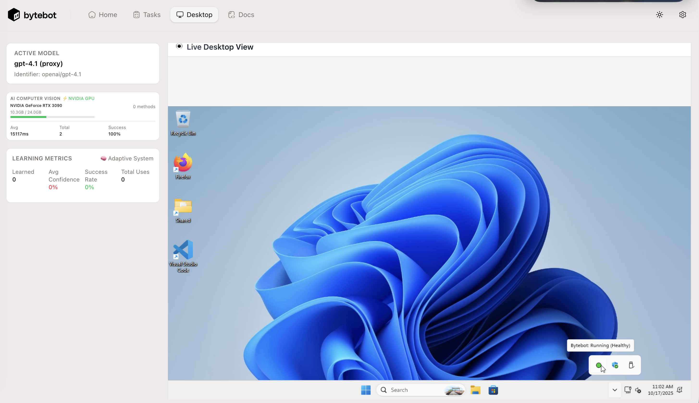

<div align="center">


# Bytebot: Open-Source AI Desktop Agent

**An AI that has its own computer to complete tasks for you**

[](https://railway.com/deploy/bytebot?referralCode=L9lKXQ)
</div>

<details>
<summary><strong>Resources &amp; Translations</strong></summary>

<div align="center">

<a href="https://trendshift.io/repositories/14624" target="_blank"></a>

[](https://github.com/bytebot-ai/bytebot/tree/main/docker)
[](LICENSE)
[](https://discord.com/invite/d9ewZkWPTP)

[🌐 Website](https://bytebot.ai) • [📚 Documentation](https://docs.bytebot.ai) • [💬 Discord](https://discord.com/invite/d9ewZkWPTP) • [𝕏 Twitter](https://x.com/bytebot_ai)

<!-- Keep these links. Translations will automatically update with the README. -->
[Deutsch](https://zdoc.app/de/bytebot-ai/bytebot) |
[Español](https://zdoc.app/es/bytebot-ai/bytebot) |
[français](https://zdoc.app/fr/bytebot-ai/bytebot) |
[日本語](https://zdoc.app/ja/bytebot-ai/bytebot) |
[한국어](https://zdoc.app/ko/bytebot-ai/bytebot) |
[Português](https://zdoc.app/pt/bytebot-ai/bytebot) |
[Русский](https://zdoc.app/ru/bytebot-ai/bytebot) |
[中文](https://zdoc.app/zh/bytebot-ai/bytebot)

</div>
</details>

---

## 📋 Prerequisites

### Required Software
- **Docker** (≥20.10) & **Docker Compose** (≥2.0)
- **Git** for cloning the repository
- **Node.js** ≥20.0.0 (for local development only, not needed for Docker)

### API Keys (Required)
At least one LLM provider API key:
- **Anthropic** (Claude models) - Get at [console.anthropic.com](https://console.anthropic.com)
- **OpenAI** (GPT models) - Get at [platform.openai.com](https://platform.openai.com)
- **Google** (Gemini models) - Get at [aistudio.google.com](https://aistudio.google.com)
- **OpenRouter** (Multi-model proxy) - Get at [openrouter.ai](https://openrouter.ai)
- **LMStudio** (Local models, optional) - FREE local inference. Configure via `./scripts/setup-lmstudio.sh`

### Disk Space Requirements

**Holo 1.5-7B Transformers Model:**
- **Model size:** ~14 GB (bfloat16 precision, official implementation)
- **Cache location:** `~/.cache/huggingface/hub/`
- **Recommended free space:** 25 GB (model + cache overhead)
- **Download time:** 10-20 minutes depending on internet speed (one-time download)
- **Backend:** transformers + accelerate with GPU acceleration

**By Platform:**
- **Apple Silicon (M1-M4):** Model downloads automatically on first run via transformers
- **x86_64 (Docker):** Model downloads when container first starts, cached for future use
- **Storage:** Model is cached permanently and reused across restarts

**Model Validation:**
The setup script validates complete model downloads by checking:
- ✅ Cache size must be ≥12GB (transformers model + safetensors)
- ✅ Model files must exist in cache directory
- ✅ Shows diagnostic info if validation fails (actual size, file count, what's missing)

**Note:** The transformers model downloads automatically on first use, so setup is optional. The service will download the model when first started.

> **Tip:** If disk space is limited, the setup script will warn you and ask for confirmation before starting (needs ~25GB). To force a clean reinstall: `./scripts/setup-holo.sh --force`

### GPU Requirements (Recommended for Best Holo 1.5-7B Performance)

Holo 1.5-7B provides precision UI localization with GPU acceleration via transformers:

#### **x86_64 Linux/Windows (NVIDIA GPU)**
**Best performance: ~1.5-3s/inference with CUDA** | **VRAM required: 14GB**

Install `nvidia-container-toolkit` to enable GPU in Docker:

```bash
# Ubuntu/Debian
sudo apt-get update
# Install the Nvidia Container Toolkit packages
export NVIDIA_CONTAINER_TOOLKIT_VERSION=1.17.8-1
  sudo apt-get install -y \
      nvidia-container-toolkit=${NVIDIA_CONTAINER_TOOLKIT_VERSION} \
      nvidia-container-toolkit-base=${NVIDIA_CONTAINER_TOOLKIT_VERSION} \
      libnvidia-container-tools=${NVIDIA_CONTAINER_TOOLKIT_VERSION} \
      libnvidia-container1=${NVIDIA_CONTAINER_TOOLKIT_VERSION}

# Configure the container so it can use the Nvidia runtime
sudo nvidia-ctk runtime configure --runtime=docker
sudo systemctl restart docker

# Verify GPU access works by running a sample workload
sudo docker run --rm --runtime=nvidia --gpus all ubuntu nvidia-smi
```

**Without GPU:** Falls back to CPU (~15-30s/inference) - works but significantly slower.

#### **Apple Silicon (M1-M4)**
**Best performance: ~2-4s/inference with Metal GPU** | **Unified memory required: 16GB+**

No additional installation needed - `setup-holo.sh` automatically configures native execution with Metal GPU acceleration.

> **Note:** Docker Desktop on macOS doesn't pass through Metal GPU access, so Holo 1.5-7B runs natively outside Docker for best performance.

#### **x86_64 CPU-only**
Works without GPU but slower (~15-30s/inference). No additional setup needed.

---

## 🚀 Quick Start (3 Simple Steps)

### Step 1: Clone Repository
```bash
git clone https://github.com/zhound420/bytebot-hawkeye-holo.git
cd bytebot-hawkeye-holo
```

### Optional: Tiny11 or macOS Desktop Container


*Bytebot agent controlling a Windows 11 desktop environment with live desktop view*

Run Bytebot with a **Tiny11** (stripped Windows 11) or **macOS** desktop environment instead of Linux:

**🎯 Interactive Mode (Easiest - NEW!):**
```bash
# Simply run start-stack.sh without any flags
./scripts/start-stack.sh

# You'll see an interactive menu:
# ════════════════════════════════════════════════
#    Target OS Selection
# ════════════════════════════════════════════════
# Which OS stack would you like to start?
#   1) Linux (desktop container - default)
#   2) Windows 11 (requires KVM)
#   3) macOS (requires KVM, Apple hardware)
#
# If you select Windows (option 2), you'll be asked:
#   Use pre-baked image? [Y/n]
#     • Pre-baked: 30-60 seconds startup (96% faster)
#     • Runtime:   8-15 minutes startup

# Access via web viewer
open http://localhost:8006  # Windows or macOS
```

**⚡ Or use direct flags (for automation/scripts):**
```bash
# Tiny11 Pre-baked Image (RECOMMENDED)
./scripts/start-stack.sh --os windows --prebaked

# Tiny11 Runtime Installation
./scripts/start-stack.sh --os windows

# macOS Sonoma/Sequoia
./scripts/start-stack.sh --os macos

# Inside macOS Terminal, run setup script as root
cd /shared
sudo bash ./setup-macos-bytebotd.sh
```

**Tiny11 Benefits:**
- 🚀 50% faster download: ~3.5GB ISO vs ~6GB Windows 11 ISO
- ⚡ 40% less resources: 6GB RAM vs 8GB, 50GB disk vs 100GB
- 🎯 Stripped Windows 11: No bloatware, fully serviceable and updateable
- ✅ Same compatibility: Works identically to Windows 11 for bytebotd
- ✅ 96% faster startup: 30-60 seconds vs 8-15 minutes (pre-baked)
- ✅ No network dependency: MSI installer baked into Docker image (pre-baked)

**Requirements:**
- KVM support (`/dev/kvm` must be available on Linux host)
- **Tiny11:** 6GB+ RAM, 4+ CPU cores, 50GB+ disk space
- **macOS:** 8GB+ RAM, 4+ CPU cores, 64GB+ disk space
- **macOS only:** Must run on Apple hardware (licensing requirement)

**Why Use Tiny11/macOS Containers?**
- Test automation on native Windows or macOS applications
- Holo 1.5-7B trained on Windows/Linux/macOS UI (same model, cross-platform)
- Same resolution across all platforms (1280x960)
- **Tiny11 benefits:** 50% faster download, 40% less resources than full Windows 11

**Ports:**
- `8006` - Web-based viewer (all platforms)
- `3389` - RDP access (Windows only)
- `5900` - VNC access (macOS only)
- `9990` - Bytebotd API (after setup)

**📚 Full Guides:**
- Windows: [`docs/WINDOWS_SETUP.md`](docs/WINDOWS_SETUP.md)
- macOS: [`docs/MACOS_SETUP.md`](docs/MACOS_SETUP.md)

### Step 2: Configure API Keys

Create `docker/.env` with your API keys (**at least one required**):

```bash
cat <<'EOF' > docker/.env
# LLM Provider API Keys (At least one required)
ANTHROPIC_API_KEY=sk-ant-...
OPENAI_API_KEY=sk-...
GEMINI_API_KEY=...
OPENROUTER_API_KEY=sk-or-v1-...
EOF
```

### Step 3: Setup & Start

The setup script automatically detects your hardware and configures optimal performance:

```bash
# One-time setup (installs Holo 1.5-7B and dependencies)
./scripts/setup-holo.sh

# Start the full stack (Interactive Mode - Recommended for first-time users)
./scripts/start-stack.sh
# → You'll be prompted to select:
#    1) Target OS (Linux/Windows/macOS)
#    2) Windows installation method (if Windows selected)

# Or use flags for automation/CI (skips all prompts)
./scripts/start-stack.sh --os linux              # Explicit Linux
./scripts/start-stack.sh --os windows --prebaked # Windows pre-baked image
./scripts/start-stack.sh --os macos              # macOS container
```

**What happens automatically:**

**Apple Silicon (M1-M4):**
- ✅ Native Holo 1.5-7B with MPS GPU (~1.5-2.5s/inference)
- ✅ Best performance via Metal acceleration

**x86_64 + NVIDIA GPU:**
- ✅ Docker container with CUDA (~0.8-1.5s/inference)
- ✅ Production-ready GPU acceleration

**x86_64 CPU-only:**
- ✅ Docker container with CPU (~8-15s/inference)
- ✅ Works everywhere without GPU

The start script will:
- Launch all services (agent, UI, desktop, database, Holo 1.5-7B)
- Apply database migrations automatically
- Verify all services are healthy

**Access the Stack:**
- 🌐 **Web UI**: http://localhost:9992
- 🖥️ **Desktop (noVNC)**: http://localhost:9990
- 🤖 **Agent API**: http://localhost:9991
- 🔀 **LiteLLM Proxy**: http://localhost:4000
- 🎯 **Holo 1.5-7B**: http://localhost:9989

**Stop the stack:**
```bash
./scripts/stop-stack.sh
```

**Optional: Configure LMStudio for Local Models (FREE)**

During stack startup, you'll be prompted to configure LMStudio:
- Answer 'y' to automatically discover and configure local models
- Or run later: `./scripts/setup-lmstudio.sh`
- Models appear in UI under "Local Models" section with FREE badge
- Zero API costs, privacy-preserving local inference
- Works alongside cloud providers (Anthropic, OpenAI, etc.)

### 💡 Interactive vs Flag-Based Mode

Both modes work identically - choose based on your workflow:

| Mode | Command | Best For |
|------|---------|----------|
| **Interactive** 🎯 | `./scripts/start-stack.sh` | First-time users, exploring options, trying different OS |
| **Flag-Based** ⚡ | `./scripts/start-stack.sh --os windows --prebaked` | Automation, CI/CD pipelines, scripting |

**Interactive Mode Features:**
- Guided OS selection menu (Linux/Windows/macOS)
- Automatic Windows pre-baked image prompt
- Default values (press Enter for Linux)
- Same friendly experience as fresh-build.sh

**Flag-Based Mode Features:**
- Skips all prompts for non-interactive environments
- Explicit OS and installation method specification
- Ideal for scripts and automation pipelines
- Backward compatible with existing workflows

### Troubleshooting Setup

**Transformers model doesn't download:**
- **Cause:** Model downloads automatically on first run via transformers
- **Fix:** Start the service and it will download automatically:
  ```bash
  ./scripts/start-holo.sh  # Apple Silicon
  ./scripts/start-stack.sh  # x86_64 in Docker
  ```

**Setup reports "already set up" but model isn't cached:**
- Scripts now validate model cache is complete (≥12GB size + model files present)
- Shows diagnostic info: actual cache size, file count, what's missing
- Auto-cleans incomplete cache if detected
- **Fix:** Just start the service - transformers will download on first run:
  ```bash
  ./scripts/start-holo.sh
  ```

**First-time setup on limited disk space:**
- Setup script checks free space and warns if <25GB available
- You can confirm to continue or cancel to free up space
- Model cache location: `~/.cache/huggingface/hub/` (~14GB)
- **Fix:** Free up disk space and run `./scripts/setup-holo.sh`

**Force reinstall (clean slate):**
```bash
./scripts/setup-holo.sh --force
```
- Removes existing venv and incomplete model cache
- Performs clean installation from scratch with latest transformers
- Useful for recovering from corrupted state or updating to new model versions

> **More help?** See [GPU Setup Guide](docs/GPU_SETUP.md) for platform-specific configuration and debugging.

## Hawkeye Fork Enhancements

Hawkeye layers precision tooling on top of upstream Bytebot so the agent can land clicks with far greater reliability:

| Capability | Hawkeye | Upstream Bytebot |
| --- | --- | --- |
| **Grid overlay guidance** | Always-on 100 px grid with labeled axes and optional debug overlays toggled via `BYTEBOT_GRID_OVERLAY`/`BYTEBOT_GRID_DEBUG`, plus a live preview in the [overlay capture](docs/images/hawkeye-desktop.png). | No persistent spatial scaffolding; relies on raw screenshots. |
| **Smart Focus targeting** | Three-stage coarse→focus→click workflow with tunable grids and prompts described in [Smart Focus System](docs/SMART_FOCUS_SYSTEM.md). | Single-shot click reasoning without structured zoom or guardrails. |
| **Progressive zoom capture** | Deterministic zoom ladder with cyan micro-grids that map local→global coordinates; see [zoom samples](test-zoom-with-grid.png). | Manual zoom commands with no coordinate reconciliation. |
| **Coordinate telemetry & accuracy** | Telemetry pipeline with `BYTEBOT_COORDINATE_METRICS` and `BYTEBOT_COORDINATE_DEBUG`, an attempt towards accuracy.(COORDINATE_ACCURACY_IMPROVEMENTS.md). | No automated accuracy measurement or debug dataset. |
| **Universal coordinate mapping** | Shared lookup in `config/universal-coordinates.yaml` bundled in repo and `@bytebot/shared`, auto-discovered without extra configuration. | Requires custom configuration for consistent coordinate frames. |
| **Universal element detection** | CV pipeline merges visual heuristics, OCR enrichments, and semantic roles to emit consistent `UniversalUIElement` metadata for buttons, inputs, and clickable controls. | LLM prompts must infer UI semantics from raw OCR spans and manually chosen click targets. |
| **Holo 1.5-7B precision localization** | AI-powered UI element localization using Holo 1.5-7B (Qwen2.5-VL-7B base, 90%+ accuracy) with GPU acceleration (NVIDIA/Apple Silicon). Direct coordinate prediction for superior click accuracy. | No semantic understanding of UI elements; relies on pixel-based analysis only. |
| **Streamlined CV pipeline** | Two-method detection: Holo 1.5-7B (primary, 90%+ accuracy) + Tesseract.js OCR (fallback). OpenCV removed for simpler builds. | Basic screenshot analysis without advanced computer vision techniques. |
| **Real-time CV activity monitoring** | Live tracking of active CV methods with animated indicators, Holo 1.5-7B model display, GPU detection (NVIDIA GPU/Apple Silicon/CPU), performance metrics, success rates, and dedicated UI panels on Desktop and Task pages with 500ms polling. | No visibility into which detection methods are active or their performance characteristics. |
| **Accessible UI theming** | Header theme toggle powered by Next.js theme switching delivers high-contrast light/dark palettes so operators can pick the most legible view. | Single default theme without in-app toggles. |
| **Active Model desktop telemetry** | The desktop dashboard's Active Model card (under `/desktop`) continuously surfaces the agent's current provider, model alias, and streaming heartbeat so you can spot token stalls before they derail long-running sessions. | No dedicated real-time status card—operators must tail logs to confirm the active model. |
| **Hybrid vision/non-vision support** | 41 models (28 vision + 13 text-only) with automatic message transformation, vision-aware prompts/guards, optimized enrichment, and enhanced UI picker with visual grouping. Enables reasoning models (o1, o3, DeepSeek R1) for complex tasks. | Limited model support with assumed vision capability; no differentiation between vision and text-only models. |

Flip individual systems off by setting the corresponding environment variables—`BYTEBOT_UNIVERSAL_TEACHING`, `BYTEBOT_ADAPTIVE_CALIBRATION`, `BYTEBOT_ZOOM_REFINEMENT`, or `BYTEBOT_COORDINATE_METRICS`—to `false` (default `true`). Enable deep-dive logs with `BYTEBOT_COORDINATE_DEBUG=true` when troubleshooting. Visit the `/desktop` route (see the screenshot above) to monitor the Active Model card while long-running tasks execute.

### Smart Focus Targeting (Hawkeye Exclusive)

The fork’s Smart Focus workflow narrows attention in three deliberate passes—coarse region selection, focused capture, and final click—so the agent can reason about targets instead of guessing. Enable or tune it with `BYTEBOT_SMART_FOCUS`, `BYTEBOT_OVERVIEW_GRID`, `BYTEBOT_REGION_GRID`, `BYTEBOT_FOCUSED_GRID`, and related knobs documented in [docs/SMART_FOCUS_SYSTEM.md](docs/SMART_FOCUS_SYSTEM.md).


### Desktop Accuracy Drawer

The `/desktop` dashboard now ships with a Desktop Accuracy drawer that exposes the fork’s adaptive telemetry at a glance. The panel streams live stats for the currently selected session, lets operators jump between historical sessions with the session selector, and provides reset controls so you can zero out a learning run before capturing a new benchmark. Use the reset button to clear the in-memory metrics without restarting the daemon when you want a clean baseline for regression tests or demonstrations.


#### Learning Metrics Explained

To help you interpret the drawer’s live readouts, Hawkeye surfaces several learning metrics that highlight how the desktop agent is adapting:

- **Attempt count** — The number of clicks evaluated during the active session. Use it to gauge how large the sample is before trusting the aggregate metrics.
- **Success rate** — Percentage of attempts that landed within the configured smart click success radius. This reflects real-time precision as the agent iterates on a task.
- **Weighted offsets** — Average X/Y drift in pixels, weighted by recency so the panel emphasizes the most recent behavior. Watch this to see whether recent tuning is nudging the cursor closer to targets.
- **Convergence** — A decay-weighted score that trends toward 1.0 as the agent stops overshooting targets, signaling that the current calibration has stabilized.
- **Hotspots** — Highlighted regions where misses cluster, helping you identify UI zones that need larger affordances, different prompts, or manual overrides.

Together, these metrics give you continuous feedback on how Hawkeye’s coordinate calibration improves over time and whether additional guardrails are necessary for stubborn workflows.

### Precision Computer Vision with Holo 1.5-7B

Hawkeye uses **Holo 1.5-7B** (Qwen2.5-VL-7B base) for precision UI localization with superior click accuracy:

#### **Two-Method Detection (OpenCV Removed)**
- **Holo 1.5-7B** (PRIMARY) - Direct coordinate prediction via vision-language model for 90%+ localization accuracy
- **Tesseract.js OCR** (FALLBACK) - Pure JavaScript text extraction for text-based elements

**What changed:** Replaced OmniParser's YOLOv8 + Florence-2 pipeline with Holo 1.5-7B for direct coordinate prediction. OpenCV-based methods have been removed to reduce complexity. Holo provides superior click accuracy with simpler architecture.

#### **Holo 1.5-7B Precision Localization (Transformers)**
Hawkeye uses **Holo 1.5-7B** (official transformers implementation) as the primary detection method, providing direct coordinate prediction with full precision:

- **Model**: Hcompany/Holo1.5-7B (official HuggingFace model)
- **Size**: ~14 GB (bfloat16 precision for optimal accuracy)
- **Backend**: transformers + accelerate with GPU acceleration
- **Method**: Direct coordinate prediction via vision-language model
- **Accuracy**: 90%+ UI element localization accuracy (superior to alternatives)
- **GPU Acceleration**: Supports NVIDIA CUDA and Apple Silicon (Metal)
- **Performance**: ~1.5-3s/inference on NVIDIA GPU, ~2-4s on Apple Silicon, ~15-30s on CPU
- **Advantages**:
  - Official implementation with full precision
  - Direct coordinate prediction eliminates bounding box→coordinate conversion errors
  - Superior cross-platform UI understanding (Windows/Linux/macOS)
  - Automatic download via transformers

**Platform Support:**
- 🍎 **Apple Silicon (M1-M4):** Native execution with Metal GPU acceleration (~2-4s/inference, 16GB+ unified memory)
- ⚡ **x86_64 + NVIDIA GPU:** Docker with CUDA support (~1.5-3s/inference, 14GB VRAM)
- 💻 **CPU-only:** Docker with CPU fallback (~15-30s/inference)

#### **Simplified Detection Orchestration**
The `EnhancedVisualDetectorService` uses Holo 1.5-7B as the primary method with Tesseract.js OCR as fallback:
```typescript
// Detection using Holo 1.5-7B + OCR
const result = await enhancedDetector.detectElements(screenshotBuffer, null, {
  useOmniParser: true,         // Primary: Holo 1.5-7B precision localization
  useOCR: false,               // Fallback: Tesseract.js text extraction (expensive)
  combineResults: true         // Merge overlapping detections
});
```

**Detection Priority:**
1. **Holo 1.5-7B** (PRIMARY) - Direct coordinate prediction with 90%+ accuracy
2. **Tesseract.js OCR** (FALLBACK) - Text extraction when Holo unavailable or disabled

#### **Real-Time CV Activity Monitoring**
Hawkeye provides comprehensive visibility into computer vision operations with live UI indicators:

- **Live Method Tracking** - `CVActivityIndicatorService` tracks which CV methods are actively processing with animated indicators
- **Holo 1.5-7B Model Display** - Real-time display of active model (Holo 1.5-7B / Qwen2.5-VL) with GPU detection (NVIDIA GPU, Apple Silicon, or CPU)
- **Performance Metrics** - Real-time success rates, processing times, average execution times, and total executions
- **GPU Acceleration Status** - Live hardware detection showing compute device: ⚡ NVIDIA GPU, 🍎 Apple Silicon, or 💻 CPU
- **GPU VRAM Monitoring** - Real-time memory usage with color-coded progress bars (green <50%, yellow 50-80%, red >80%)
- **UI Integration** - Dedicated CV Activity panels on both Desktop and Task pages with 500ms polling for real-time updates
- **Debug Telemetry** - Comprehensive method execution history for optimization and troubleshooting

### Adaptive Model Capability System

Hawkeye's **Model Capability System** provides intelligent CV-first enforcement based on each AI model's vision capabilities. Different models receive different levels of enforcement, ensuring optimal performance without blocking capable models or frustrating weaker ones.

#### **Three-Tier Model Classification**

**🥇 Tier 1: Strong CV Capability (Strict Enforcement)**
- **Models**: GPT-4o, Claude Sonnet 4.5, Claude Opus 4, Claude 3.5 Sonnet
- **CV Success Rate**: 90-95%
- **Behavior**: Strict CV-first workflow enforcement, no click violations allowed
- **Testing**: GPT-4o demonstrated 100% CV-first compliance with adaptive keyboard fallback
- **Max CV Attempts**: 2 before keyboard shortcut suggestions

**🥈 Tier 2: Medium CV Capability (Balanced Enforcement)**
- **Models**: GPT-4o-mini, Gemini 2.0 Flash, Gemini 1.5 Pro, Claude 3 Haiku
- **CV Success Rate**: 75-85%
- **Behavior**: Relaxed enforcement (allow 1 click violation), emphasized keyboard shortcuts
- **Max CV Attempts**: 3 before alternative approaches
- **Default**: Unknown models default to Tier 2 for balanced behavior

**🥉 Tier 3: Weak CV Capability (Minimal Enforcement)**
- **Models**: Qwen3-VL, LLaVA, CogVLM
- **CV Success Rate**: 40-50%
- **Behavior**: Suggest CV-first but don't block, keyboard-first prompts
- **Testing**: Qwen3-VL showed 4 click violations and detect→click loops, required help
- **Max CV Attempts**: 2 with aggressive loop detection

#### **Real-World Performance Data**

Based on production session analysis comparing GPT-4o vs Qwen3-VL:

| Metric | GPT-4o (Tier 1) | Qwen3-VL (Tier 3) |
|--------|----------------|-------------------|
| **Assistant Messages** | 8 | 21 (2.6x more) |
| **CV Detection Attempts** | 2 | 6 |
| **Click Violations** | 0 ✅ | 4 ❌ |
| **Workflow Quality** | Clean with keyboard fallback | Stuck in detect→click loops |
| **Outcome** | Adaptive completion | Requested help (loop detected) |

#### **Adaptive Enforcement Features**

- **Pattern Matching**: Fuzzy model name matching for automatic tier assignment
- **Loop Detection**: Tier 3 models get more sensitive loop detection (2 failures vs 3)
- **Dynamic Prompts**: Future: Different system prompts per tier emphasizing strengths
- **Fallback Strategies**: Future: Tier-specific fallback chains (CV → Keyboard → Coords)

**Location**: `packages/bytebot-agent/src/models/`
**Configuration**: See `model-capabilities.config.ts` for full model database

### Hybrid Vision/Non-Vision Model Support

Hawkeye now supports **both vision-capable and text-only models** with intelligent content adaptation. The system automatically transforms visual content based on each model's capabilities, enabling you to use reasoning models (o1, o3, DeepSeek R1) and other non-vision models alongside vision models.

#### **Intelligent Content Transformation**

When you select a non-vision model, Hawkeye automatically:

- **Transforms Images → Text Descriptions**: Screenshots and uploaded images are converted to detailed text descriptions including metadata (resolution, capture time, file size)
- **Adapts System Prompts**: Non-vision models receive instructions focused on text-based analysis and tool results, while vision models get visual observation prompts
- **Skips Visual Observation Guards**: Screenshot observation requirements only apply to vision models; non-vision models can proceed immediately after screenshots
- **Optimizes Background Processing**: Holo 1.5-7B enrichment only runs for vision models, eliminating unnecessary 30-80s detections for text-only models

#### **Supported Non-Vision Models (13 Added)**

**OpenAI Reasoning Models:**
- `o3-pro`, `o3`, `o3-mini` - Advanced reasoning with extended thinking time
- `o1`, `o1-mini`, `o1-preview` - Original reasoning model series

**OpenRouter Models:**
- `openrouter-deepseek-r1` - DeepSeek's flagship reasoning model
- `openrouter-deepseek-r1-distill-qwen-32b` - Qwen-distilled variant (32B)
- `openrouter-deepseek-r1-distill-llama-70b` - Llama-distilled variant (70B)
- `openrouter-qwen-plus`, `openrouter-qwen-turbo`, `openrouter-qwen-max` - Qwen series
- `openrouter-claude-3-haiku` - Fast, cost-effective Claude variant
- `openrouter-mistral-large` - Mistral's flagship model

**Total:** 41 models supported (28 vision + 13 text-only)

#### **Enhanced Model Picker UI**

The model selection dropdown now features visual differentiation:

- **👁️ Vision Models Section** - Eye icon with blue theme for image-capable models
- **📝 Text-Only Models Section** - FileText icon with amber theme for text-only models
- **Color-Coded Badges** - "Vision" (blue) or "Text-Only" (amber) labels
- **Descriptive Headers** - "Can process images" vs "Text descriptions only"
- **Scrolling Support** - Smooth scrolling for all 41 models with max-height constraint

The UI makes it immediately clear which models support image input, preventing confusion when uploading files or expecting visual analysis.

#### **Technical Implementation**

**Message Transformation Pipeline** (`message-transformer.util.ts`):
```typescript
// Automatically transforms images for non-vision models
if (!model.supportsVision) {
  messages = transformImagesForNonVision(messages);
  // Converts Image blocks → Text descriptions
  // Handles nested images in ToolResult blocks
}
```

**Vision-Aware Prompts** (`tier-specific-prompts.ts`):
```typescript
buildTierSpecificAgentSystemPrompt(tier, maxCvAttempts, currentDate, currentTime, timeZone, supportsVision)
// Different instructions per capability:
// - Vision models: "deliver exhaustive visual observation"
// - Non-vision: "review text descriptions and tool results"
```

**Optimized Enrichment** (`agent.processor.ts`):
```typescript
// Only run Holo for vision models
if (isScreenshot && supportsVision(model)) {
  enrichScreenshotWithOmniParser(); // 30-80s Holo detection
}
```

**Benefits:**
- ✅ Reasoning models (o1, o3, DeepSeek R1) now accessible for complex tasks
- ✅ No manual configuration - automatic adaptation based on model capabilities
- ✅ Performance optimization - skip expensive CV for text-only models
- ✅ Better UX - clear visual indicators of model capabilities
- ✅ Consistent experience - both model types use same tool APIs

**CV Activity Panel Features:**
- Active method indicators with color-coded badges (Holo 1.5-7B: Pink, OCR: Yellow)
- Live execution timers showing how long each method has been processing
- Performance grid: Avg Time, Total Executions, Success Rate, Compute Device
- Automatic visibility when CV methods are active or have recent execution history

#### **API Endpoints for CV Visibility**
```bash
GET /cv-activity/stream      # Real-time activity snapshot with Holo model info (polled every 500ms by UI)
GET /cv-activity/status      # Current active methods snapshot
GET /cv-activity/active      # Quick active/inactive check
GET /cv-activity/performance # Method performance statistics
GET /cv-activity/history     # Method execution history (last 20 executions)
```

**Response includes:**
- Active methods array with execution timers
- Holo device type (cuda, mps, cpu)
- Holo model info (Holo 1.5-7B / Qwen2.5-VL base)
- Performance metrics (avg processing time, total executions, success rate)

#### **Universal Element Detection Pipeline**
The streamlined system outputs structured `UniversalUIElement` objects by fusing:

- **Holo 1.5-7B precision localization** (PRIMARY) - Direct coordinate prediction for 90%+ click accuracy
- **Tesseract.js OCR** (FALLBACK) - Pure JavaScript text extraction
- **Semantic analysis** (`TextSemanticAnalyzerService`) for intent-based reasoning over raw UI text

**Benefits of Holo 1.5-7B:**
- ✅ Superior click accuracy (90%+ vs 89% OmniParser)
- ✅ Direct coordinate prediction (no bbox→coordinate conversion)
- ✅ Simpler architecture (single VLM vs YOLO + Florence-2 pipeline)
- ✅ Same platform support (CUDA, MPS, CPU)
- ✅ No OpenCV dependencies (simpler installation)

### Keyboard & Shortcut Reliability

`NutService` on the desktop daemon parses compound shortcuts such as `ctrl+shift+p`, mixed-case modifiers, and platform aliases (`cmd`, `option`, `win`). Legacy arrays like `['Control', 'Shift', 'X']` continue to work, but LLM tool calls can now emit compact strings and rely on the daemon to normalize, validate, and execute the correct nut-js sequence.

### Troubleshooting

**UI shows "ECONNREFUSED" to port 9991:**
- Check agent health: `docker compose ps bytebot-agent`
- View agent logs: `docker compose logs bytebot-agent`
- Verify database migrations: `docker exec bytebot-agent npx prisma migrate status`

**Holo 1.5-7B connection issues:**
- Apple Silicon: Ensure native Holo is running: `lsof -i :9989`
- x86_64: Check Holo container: `docker logs bytebot-holo`
- Verify `HOLO_URL` in `docker/.env` matches your platform

**Database errors:**
- The agent automatically applies migrations on startup
- Manual migration: `docker exec bytebot-agent npx prisma migrate deploy`

**Setup script issues:**
- **Model cache incomplete:** Check cache size: `du -sh ~/.cache/huggingface/hub/models--Hcompany--Holo1.5-7B/` (should be ~14GB)
- **Download fails:** Models download automatically via transformers on first run
- **Transformers errors:** Run `./scripts/setup-holo.sh --force` to reinstall with correct dependencies
- **Disk space:** Needs 25GB free - script checks and warns before starting

## Advanced: Manual Docker Compose Setup


If you prefer to run Docker Compose manually instead of using the automated `start-stack.sh` script, follow these steps:

### Using the Proxy Stack (Recommended)

The proxy stack includes LiteLLM for unified model access across providers:

```bash
# 1. Configure API keys in docker/.env (API keys ONLY)
cat <<'EOF' > docker/.env
ANTHROPIC_API_KEY=sk-ant-...
OPENAI_API_KEY=sk-...
GEMINI_API_KEY=...
OPENROUTER_API_KEY=sk-or-v1-...
EOF

# 2. System configuration is already set in docker/.env.defaults
#    (OmniParser settings, Hawkeye features, etc.)

# 3. Start the full stack with proxy
docker compose -f docker/docker-compose.proxy.yml up -d --build
```

**Available Models via Proxy (41 Total: 28 Vision + 13 Text-Only):**

**Vision Models (👁️ Can process images):**
- **Anthropic**: `claude-opus-4`, `claude-sonnet-4`
- **OpenAI**: `gpt-4o`, `gpt-4o-mini`, `gpt-4.1`, `gpt-5-thinking`, `gpt-5-main`, `gpt-5-mini`, `gpt-5-nano`
- **OpenRouter**: `openrouter-claude-3.5-sonnet`, `openrouter-claude-3.7-sonnet`, `openrouter-gemini-2.5-pro`, `openrouter-gemini-2.5-flash`, `openrouter-gemini-1.5-pro`, `openrouter-internvl3-78b`, `openrouter-qwen3-vl-235b-a22b-instruct`
- **Gemini**: `gemini-1.5-pro`, `gemini-1.5-flash`, `gemini-vertex-pro`, `gemini-vertex-flash`

**Text-Only Models (📝 Receive text descriptions):**
- **OpenAI Reasoning**: `o3-pro`, `o3`, `o3-mini`, `o1`, `o1-mini`, `o1-preview`
- **OpenRouter**: `openrouter-deepseek-r1`, `openrouter-deepseek-r1-distill-qwen-32b`, `openrouter-deepseek-r1-distill-llama-70b`, `openrouter-qwen-plus`, `openrouter-qwen-turbo`, `openrouter-qwen-max`, `openrouter-claude-3-haiku`, `openrouter-mistral-large`, `openrouter-glm-4.6`, `openrouter-grok-4-fast-free`

**Local LMStudio Models (💻 Auto-generated, FREE):**
- Models are discovered automatically from your LMStudio server via `./scripts/setup-lmstudio.sh`
- Appear in UI under "Local Models" section with green Monitor icon and FREE badge
- Vision support auto-detected from model names (llava, qwen-vl, cogvlm, etc.)
- To reconfigure: `./scripts/setup-lmstudio.sh`
- No manual `litellm-config.yaml` editing required

To use custom cloud model endpoints, edit `litellm-config.yaml` and restart: `docker compose restart bytebot-llm-proxy`

### Using the Standard Stack (No Proxy)

The standard stack connects directly to provider APIs without LiteLLM:

```bash
# Start without proxy (uses direct API keys)
docker compose -f docker/docker-compose.yml up -d --build
```

**Note:** Direct API access requires API keys in `docker/.env`. The agent will use the provider-specific services (Anthropic, OpenAI, Google) directly.

## LMStudio Local Models (Optional)

Run models locally with **zero API costs** through LMStudio integration. The setup script automatically discovers models and configures the LiteLLM proxy.

### Quick Setup

**Option 1: Interactive (During Stack Startup)**
```bash
./scripts/start-stack.sh
# Answer 'y' to "Configure LMStudio?" prompt
# Enter LMStudio server IP:port (default: 192.168.4.112:1234)
# Select models to enable from auto-discovered list
```

**Option 2: Standalone Configuration**
```bash
./scripts/setup-lmstudio.sh
# Prompts for server IP, discovers models, generates config
# Restart stack to load new models:
./scripts/stop-stack.sh && ./scripts/start-stack.sh
```

### What the Setup Script Does

1. **Connects to LMStudio** - Prompts for server IP:port (default: 192.168.4.112:1234)
2. **Tests Connectivity** - Verifies server is reachable via `/v1/models` endpoint
3. **Discovers Models** - Fetches all loaded models from LMStudio
4. **Detects Vision Support** - Auto-identifies vision models (llava, qwen-vl, cogvlm, etc.) from model names
5. **Interactive Selection** - Let you choose which models to enable (or select 'all')
6. **Generates Config** - Creates LiteLLM entries in `packages/bytebot-llm-proxy/litellm-config.yaml`
7. **Updates Environment** - Sets `LMSTUDIO_ENABLED=true` and `LMSTUDIO_BASE_URL` in `docker/.env`

### UI Features

Models appear in the picker under **"Local Models"** section:
- 💻 Monitor icon with green theme
- **FREE** badge (no API costs)
- Vision models show dual badges: **FREE** + **Vision**
- Separate from cloud providers for instant clarity
- Clear distinction between local (free) and cloud (paid) models

### Deployment Options

#### **Option 1: LMStudio on Separate Host (Recommended)**

Run LMStudio on a different machine with its own GPU:

**Setup:**
```bash
# On LMStudio host machine:
# 1. Start LMStudio with network binding: --host 0.0.0.0
# 2. Note the IP address (e.g., 192.168.4.112)
# 3. Verify port 1234 is accessible:
curl http://192.168.4.112:1234/v1/models

# On Bytebot machine:
./scripts/setup-lmstudio.sh
# Enter: 192.168.4.112:1234 when prompted
```

**Advantages:**
- ✅ Holo gets full local GPU for fast UI localization (~1.5-2.5s on Apple Silicon)
- ✅ LMStudio models run on separate hardware with dedicated resources
- ✅ No GPU memory contention between Holo and LLMs
- ✅ Best performance for both systems
- ✅ Can use large models (70B+) without affecting Holo
- ✅ Automatic model discovery - no manual config editing

#### **Option 2: LMStudio Locally (Only for Massive GPUs)**

Only viable if you have exceptional hardware:

```bash
# Requires >24GB GPU memory
./scripts/setup-lmstudio.sh
# Enter: localhost:1234 when prompted
```

**Requirements:**
- **Apple Silicon:** M3 Max (96GB+ unified memory) or M4 Max with 128GB+ RAM
- **x86_64 Workstation:** >24GB VRAM (RTX 4090, RTX 6000 Ada, A6000, etc.)

**Why:** Running Holo 1.5-7B transformers (14GB VRAM) + large LLM models (7-70B) simultaneously requires substantial GPU memory. Most consumer hardware can't handle both.

### Reconfiguration

Models not showing up? Need to add more?

```bash
./scripts/setup-lmstudio.sh
# Script will:
# 1. Detect and remove old LMStudio entries
# 2. Rediscover currently loaded models
# 3. Let you select which models to enable
# 4. Update configuration files
```

### Summary: Best Practices

| Setup | Holo Location | LLM Location | Best For |
|-------|---------------|--------------|----------|
| **Recommended** | Local (native with MPS GPU) | Remote LMStudio host | Maximum performance, large models, zero API costs |
| **Simplest** | Local (native with MPS GPU) | Cloud API (Anthropic/OpenAI) | Easy setup, frontier models, no GPU constraints |
| **Power Users** | Local (native with MPS GPU) | Local LMStudio (if >24GB GPU) | Massive hardware, privacy needs, complete local stack |

**Bottom line:** Use `setup-lmstudio.sh` for automatic discovery and configuration. Unless you have exceptional GPU hardware (>24GB), run LMStudio on a separate host to avoid GPU memory contention with Holo 1.5-7B.

## Alternative Deployments

Looking for a different hosting environment? Follow the upstream guides for the full walkthroughs:

- [Railway one-click template](https://docs.bytebot.ai/deployment/railway)
- [Helm charts for Kubernetes](https://docs.bytebot.ai/deployment/helm)
- [Custom Docker Compose topologies](https://docs.bytebot.ai/deployment/litellm)

## Stay in Sync with Upstream Bytebot

For a full tour of the core desktop agent, installation options, and API surface, follow the upstream README and docs. Hawkeye inherits everything there—virtual desktop orchestration, task APIs, and deployment guides—so this fork focuses documentation on the precision tooling and measurement upgrades described above.

## Further Reading

- [Bytebot upstream README](https://github.com/bytebot-ai/bytebot#readme)
- [Quickstart guide](https://docs.bytebot.ai/quickstart)
- [API reference](https://docs.bytebot.ai/api-reference/introduction)

## Operations & Tuning

### Smart Click Success Radius

Smart click telemetry now records the real cursor landing position. Tune the pass/fail threshold by setting an environment variable on the desktop daemon:

```bash
export BYTEBOT_SMART_CLICK_SUCCESS_RADIUS=12  # pixels of acceptable drift
```

Increase the value if the VNC stream or hardware introduces more cursor drift, or decrease it to tighten the definition of a successful AI-guided click.
