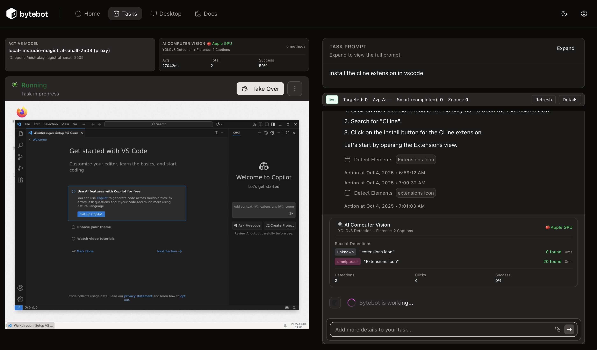
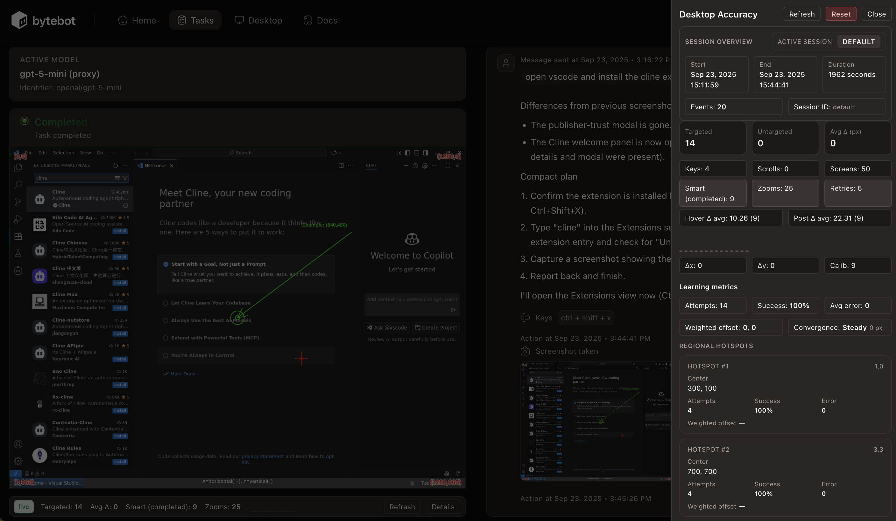
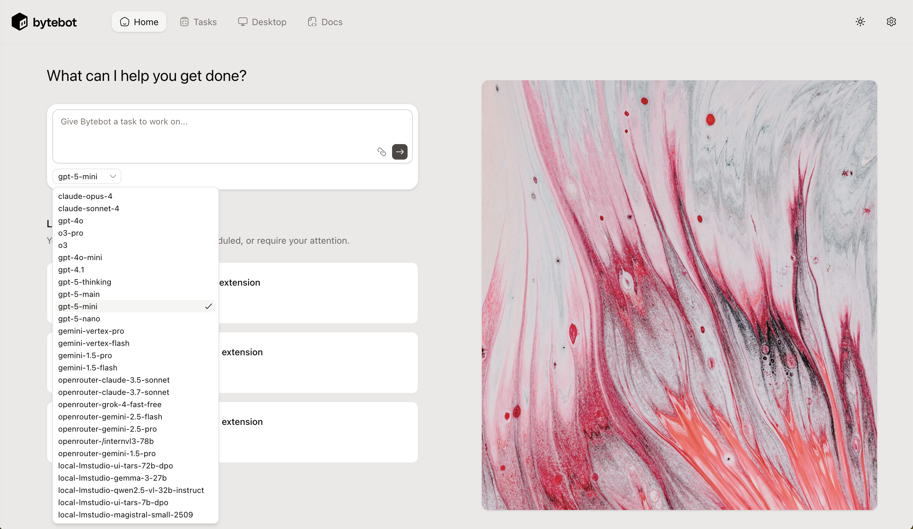

<div align="center">


# Bytebot: Open-Source AI Desktop Agent

**An AI that has its own computer to complete tasks for you**

[](https://railway.com/deploy/bytebot?referralCode=L9lKXQ)
</div>

<details>
<summary><strong>Resources &amp; Translations</strong></summary>

<div align="center">

<a href="https://trendshift.io/repositories/14624" target="_blank"></a>

[](https://github.com/bytebot-ai/bytebot/tree/main/docker)
[](LICENSE)
[](https://discord.com/invite/d9ewZkWPTP)

[🌐 Website](https://bytebot.ai) • [📚 Documentation](https://docs.bytebot.ai) • [💬 Discord](https://discord.com/invite/d9ewZkWPTP) • [𝕏 Twitter](https://x.com/bytebot_ai)

<!-- Keep these links. Translations will automatically update with the README. -->
[Deutsch](https://zdoc.app/de/bytebot-ai/bytebot) |
[Español](https://zdoc.app/es/bytebot-ai/bytebot) |
[français](https://zdoc.app/fr/bytebot-ai/bytebot) |
[日本語](https://zdoc.app/ja/bytebot-ai/bytebot) |
[한국어](https://zdoc.app/ko/bytebot-ai/bytebot) |
[Português](https://zdoc.app/pt/bytebot-ai/bytebot) |
[Русский](https://zdoc.app/ru/bytebot-ai/bytebot) |
[中文](https://zdoc.app/zh/bytebot-ai/bytebot)

</div>
</details>

---

## 📋 Prerequisites

### Required Software
- **Docker** (≥20.10) & **Docker Compose** (≥2.0)
- **Git** for cloning the repository
- **Node.js** ≥20.0.0 (for local development only, not needed for Docker)

### API Keys (Required)
At least one LLM provider API key:
- **Anthropic** (Claude models) - Get at [console.anthropic.com](https://console.anthropic.com)
- **OpenAI** (GPT models) - Get at [platform.openai.com](https://platform.openai.com)
- **Google** (Gemini models) - Get at [aistudio.google.com](https://aistudio.google.com)
- **OpenRouter** (Multi-model proxy) - Get at [openrouter.ai](https://openrouter.ai)

### GPU Requirements (Recommended for Best OmniParser Performance)

OmniParser v2.0 provides semantic UI detection with GPU acceleration:

#### **x86_64 Linux/Windows (NVIDIA GPU)**
**Best performance: ~0.6s/frame with CUDA**

Install `nvidia-container-toolkit` to enable GPU in Docker:

```bash
# Ubuntu/Debian
sudo apt-get update
sudo apt-get install -y nvidia-container-toolkit
sudo systemctl restart docker

# Verify GPU access works
docker run --rm --gpus all nvidia/cuda:11.8.0-base-ubuntu22.04 nvidia-smi
```

**Without GPU:** Falls back to CPU (~8-15s/frame) - works but significantly slower.

#### **Apple Silicon (M1-M4)**
**Best performance: ~1-2s/frame with MPS**

No additional installation needed - `setup-omniparser.sh` automatically configures native execution with Metal GPU acceleration.

> **Note:** Docker Desktop on macOS doesn't pass through GPU access, so OmniParser runs natively outside Docker for best performance.

#### **x86_64 CPU-only**
Works without GPU but slower (~8-15s/frame). No additional setup needed.

---

## 🚀 Quick Start (Platform-Optimized)

**Three-step setup that automatically detects your platform and optimizes for best performance:**

### Step 1: Clone Repository
```bash
git clone https://github.com/zhound420/bytebot-hawkeye-cv.git
cd bytebot-hawkeye-cv
```

### Step 2: Configure API Keys

Create `docker/.env` with your API keys (**API keys only**, system config goes in `.env.defaults`):

```bash
cat <<'EOF' > docker/.env
# LLM Provider API Keys (Required)
ANTHROPIC_API_KEY=sk-ant-...
OPENAI_API_KEY=sk-...
GEMINI_API_KEY=...
OPENROUTER_API_KEY=sk-or-v1-...
EOF
```

### Step 3: Setup OmniParser (Platform-Specific)

The setup script automatically detects your hardware and installs the optimal configuration:

```bash
./scripts/setup-omniparser.sh
```

**What happens automatically:**

- **Apple Silicon (M1-M4):** Native OmniParser with MPS GPU (~1-2s/frame) - Best performance
- **x86_64 + NVIDIA GPU:** Docker container with CUDA (~0.6s/frame) - Production-ready
- **x86_64 CPU-only:** Docker container with CPU (~8-15s/frame) - Works everywhere

### Step 4: Start the Stack

```bash
./scripts/start-stack.sh
```

The start script will:
- ✅ Detect your platform and configure OmniParser connectivity
- ✅ Start native OmniParser (Apple Silicon) or Docker container (x86_64)
- ✅ Launch all services: agent, UI, desktop, postgres, LLM proxy
- ✅ Apply database migrations automatically
- ✅ Verify all services are healthy

**Access the Stack:**
- 🌐 Web UI: http://localhost:9992
- 🖥️ Desktop (noVNC): http://localhost:9990
- 🤖 Agent API: http://localhost:9991
- 🔀 LiteLLM Proxy: http://localhost:4000
- 👁️ OmniParser: http://localhost:9989

**Stop the stack:**
```bash
./scripts/stop-stack.sh
```

> **GPU not detected?** See [GPU Setup Guide](docs/GPU_SETUP.md) for troubleshooting and explicit GPU configuration.

## Hawkeye Fork Enhancements

Hawkeye layers precision tooling on top of upstream Bytebot so the agent can land clicks with far greater reliability:

| Capability | Hawkeye | Upstream Bytebot |
| --- | --- | --- |
| **Grid overlay guidance** | Always-on 100 px grid with labeled axes and optional debug overlays toggled via `BYTEBOT_GRID_OVERLAY`/`BYTEBOT_GRID_DEBUG`, plus a live preview in the [overlay capture](docs/images/hawkeye-desktop.png). | No persistent spatial scaffolding; relies on raw screenshots. |
| **Smart Focus targeting** | Three-stage coarse→focus→click workflow with tunable grids and prompts described in [Smart Focus System](docs/SMART_FOCUS_SYSTEM.md). | Single-shot click reasoning without structured zoom or guardrails. |
| **Progressive zoom capture** | Deterministic zoom ladder with cyan micro-grids that map local→global coordinates; see [zoom samples](test-zoom-with-grid.png). | Manual zoom commands with no coordinate reconciliation. |
| **Coordinate telemetry & accuracy** | Telemetry pipeline with `BYTEBOT_COORDINATE_METRICS` and `BYTEBOT_COORDINATE_DEBUG`, an attempt towards accuracy.(COORDINATE_ACCURACY_IMPROVEMENTS.md). | No automated accuracy measurement or debug dataset. |
| **Universal coordinate mapping** | Shared lookup in `config/universal-coordinates.yaml` bundled in repo and `@bytebot/shared`, auto-discovered without extra configuration. | Requires custom configuration for consistent coordinate frames. |
| **Universal element detection** | CV pipeline merges visual heuristics, OCR enrichments, and semantic roles to emit consistent `UniversalUIElement` metadata for buttons, inputs, and clickable controls. | LLM prompts must infer UI semantics from raw OCR spans and manually chosen click targets. |
| **OmniParser v2.0 semantic detection** | AI-powered semantic UI detection using YOLOv8 icon detection + Florence-2 captioning with GPU acceleration (NVIDIA/Apple Silicon). Includes semantic mapping learning and training data collection for continuous improvement. | No semantic understanding of UI elements; relies on pixel-based analysis only. |
| **Streamlined CV pipeline** | Two-method detection: OmniParser v2.0 (primary, 89% accuracy) + Tesseract.js OCR (fallback). OpenCV removed for simpler builds. | Basic screenshot analysis without advanced computer vision techniques. |
| **Real-time CV activity monitoring** | Live tracking of active CV methods with animated indicators, OmniParser model display (YOLOv8 + Florence-2), GPU detection (NVIDIA GPU/Apple Silicon/CPU), performance metrics, success rates, and dedicated UI panels on Desktop and Task pages with 500ms polling. | No visibility into which detection methods are active or their performance characteristics. |
| **Accessible UI theming** | Header theme toggle powered by Next.js theme switching delivers high-contrast light/dark palettes so operators can pick the most legible view. | Single default theme without in-app toggles. |
| **Active Model desktop telemetry** | The desktop dashboard's Active Model card (under `/desktop`) continuously surfaces the agent's current provider, model alias, and streaming heartbeat so you can spot token stalls before they derail long-running sessions. | No dedicated real-time status card—operators must tail logs to confirm the active model. |

Flip individual systems off by setting the corresponding environment variables—`BYTEBOT_UNIVERSAL_TEACHING`, `BYTEBOT_ADAPTIVE_CALIBRATION`, `BYTEBOT_ZOOM_REFINEMENT`, or `BYTEBOT_COORDINATE_METRICS`—to `false` (default `true`). Enable deep-dive logs with `BYTEBOT_COORDINATE_DEBUG=true` when troubleshooting. Visit the `/desktop` route (see the screenshot above) to monitor the Active Model card while long-running tasks execute.

### Smart Focus Targeting (Hawkeye Exclusive)

The fork’s Smart Focus workflow narrows attention in three deliberate passes—coarse region selection, focused capture, and final click—so the agent can reason about targets instead of guessing. Enable or tune it with `BYTEBOT_SMART_FOCUS`, `BYTEBOT_OVERVIEW_GRID`, `BYTEBOT_REGION_GRID`, `BYTEBOT_FOCUSED_GRID`, and related knobs documented in [docs/SMART_FOCUS_SYSTEM.md](docs/SMART_FOCUS_SYSTEM.md).



### Desktop Accuracy Drawer

The `/desktop` dashboard now ships with a Desktop Accuracy drawer that exposes the fork’s adaptive telemetry at a glance. The panel streams live stats for the currently selected session, lets operators jump between historical sessions with the session selector, and provides reset controls so you can zero out a learning run before capturing a new benchmark. Use the reset button to clear the in-memory metrics without restarting the daemon when you want a clean baseline for regression tests or demonstrations.



#### Learning Metrics Explained

To help you interpret the drawer’s live readouts, Hawkeye surfaces several learning metrics that highlight how the desktop agent is adapting:

- **Attempt count** — The number of clicks evaluated during the active session. Use it to gauge how large the sample is before trusting the aggregate metrics.
- **Success rate** — Percentage of attempts that landed within the configured smart click success radius. This reflects real-time precision as the agent iterates on a task.
- **Weighted offsets** — Average X/Y drift in pixels, weighted by recency so the panel emphasizes the most recent behavior. Watch this to see whether recent tuning is nudging the cursor closer to targets.
- **Convergence** — A decay-weighted score that trends toward 1.0 as the agent stops overshooting targets, signaling that the current calibration has stabilized.
- **Hotspots** — Highlighted regions where misses cluster, helping you identify UI zones that need larger affordances, different prompts, or manual overrides.

Together, these metrics give you continuous feedback on how Hawkeye’s coordinate calibration improves over time and whether additional guardrails are necessary for stubborn workflows.

### Simplified Computer Vision Pipeline (OmniParser v2.0 + Tesseract.js)

Hawkeye uses a **streamlined computer vision pipeline** focused on semantic understanding and reliability:

#### **Two-Method Detection (OpenCV Removed)**
- **OmniParser v2.0** (PRIMARY) - Semantic UI detection using YOLOv8 icon detection + Florence-2 captioning for functional element understanding
- **Tesseract.js OCR** (FALLBACK) - Pure JavaScript text extraction for text-based elements

**What changed:** OpenCV-based methods (template matching, feature detection, contour analysis) have been removed to reduce build complexity and improve maintainability. OmniParser provides superior semantic understanding with 89% click accuracy.

#### **OmniParser v2.0 Semantic Detection**
Hawkeye now includes **OmniParser v2.0** as the primary detection method, providing AI-powered semantic understanding of UI elements:

- **YOLOv8 Icon Detection** (~50MB model) - Fine-tuned for UI elements with high-confidence bounding boxes
- **Florence-2 Captioning** (~800MB model) - Generates functional descriptions like "search button" or "settings menu"
- **Semantic Mapping Learning** - Automatically learns element mappings from successful interactions, improving accuracy over time
- **Training Data Collection** - Captures caption training data for model improvement and fine-tuning
- **GPU Acceleration** - Supports NVIDIA CUDA, Apple Silicon (MPS), and CPU fallback
- **Performance** - ~0.6s/frame on NVIDIA GPU, ~1-2s on Apple Silicon, ~8-15s on CPU
- **Benchmark** - 39.6% accuracy on ScreenSpot Pro benchmark

**Platform Support:**
- 🍎 **Apple Silicon (M1-M4):** Native execution with MPS GPU acceleration (~1-2s/frame)
- ⚡ **x86_64 + NVIDIA GPU:** Docker with CUDA support (~0.6s/frame)
- 💻 **CPU-only:** Docker with CPU fallback (~8-15s/frame)

#### **Simplified Detection Orchestration**
The `EnhancedVisualDetectorService` uses OmniParser as the primary method with Tesseract.js OCR as fallback:
```typescript
// Detection using OmniParser + OCR
const result = await enhancedDetector.detectElements(screenshotBuffer, null, {
  useOmniParser: true,         // Primary: Semantic UI detection (YOLOv8 + Florence-2)
  useOCR: false,               // Fallback: Tesseract.js text extraction (expensive)
  combineResults: true         // Merge overlapping detections
});
```

**Detection Priority:**
1. **OmniParser** (PRIMARY) - Semantic UI detection with YOLOv8 + Florence-2
2. **Tesseract.js OCR** (FALLBACK) - Text extraction when OmniParser unavailable or disabled

#### **Real-Time CV Activity Monitoring**
Hawkeye provides comprehensive visibility into computer vision operations with live UI indicators:

- **Live Method Tracking** - `CVActivityIndicatorService` tracks which CV methods are actively processing with animated indicators
- **OmniParser Model Display** - Real-time display of active models (YOLOv8 + Florence-2) with GPU detection (NVIDIA GPU, Apple Silicon, or CPU)
- **Performance Metrics** - Real-time success rates, processing times, average execution times, and total executions
- **GPU Acceleration Status** - Live hardware detection showing compute device: ⚡ NVIDIA GPU, 🍎 Apple Silicon, or 💻 CPU
- **UI Integration** - Dedicated CV Activity panels on both Desktop and Task pages with 500ms polling for real-time updates
- **Debug Telemetry** - Comprehensive method execution history for optimization and troubleshooting

**CV Activity Panel Features:**
- Active method indicators with color-coded badges (OmniParser: Pink, OCR: Yellow)
- Live execution timers showing how long each method has been processing
- Performance grid: Avg Time, Total Executions, Success Rate, Compute Device
- Automatic visibility when CV methods are active or have recent execution history

#### **API Endpoints for CV Visibility**
```bash
GET /cv-activity/stream      # Real-time activity snapshot with OmniParser model info (polled every 500ms by UI)
GET /cv-activity/status      # Current active methods snapshot
GET /cv-activity/active      # Quick active/inactive check
GET /cv-activity/performance # Method performance statistics
GET /cv-activity/history     # Method execution history (last 20 executions)
```

**Response includes:**
- Active methods array with execution timers
- OmniParser device type (cuda, mps, cpu)
- OmniParser models (icon_detector: "YOLOv8", caption_model: "Florence-2")
- Performance metrics (avg processing time, total executions, success rate)

#### **Universal Element Detection Pipeline**
The streamlined system outputs structured `UniversalUIElement` objects by fusing:

- **OmniParser v2.0 semantic detection** (PRIMARY) - YOLOv8 + Florence-2 for functional understanding with semantic mapping learning
- **Tesseract.js OCR** (FALLBACK) - Pure JavaScript text extraction
- **Semantic analysis** (`TextSemanticAnalyzerService`) for intent-based reasoning over raw UI text with functional term weighting

**Semantic Mapping Learning:**
- Automatically learns element mappings from successful interactions
- 2x functional term weighting for better semantic matching
- Screenshot caching with 2-second TTL for performance
- Training data collection for continuous model improvement

**Benefits of OpenCV Removal:**
- ✅ Simpler installation (no native C++ compilation)
- ✅ Smaller package size (~850MB vs multiple GB)
- ✅ Better cross-platform compatibility
- ✅ Superior detection accuracy with OmniParser (89% vs ~60% with classical CV)

### Keyboard & Shortcut Reliability

`NutService` on the desktop daemon parses compound shortcuts such as `ctrl+shift+p`, mixed-case modifiers, and platform aliases (`cmd`, `option`, `win`). Legacy arrays like `['Control', 'Shift', 'X']` continue to work, but LLM tool calls can now emit compact strings and rely on the daemon to normalize, validate, and execute the correct nut-js sequence.

### Troubleshooting

**UI shows "ECONNREFUSED" to port 9991:**
- Check agent health: `docker compose ps bytebot-agent`
- View agent logs: `docker compose logs bytebot-agent`
- Verify database migrations: `docker exec bytebot-agent npx prisma migrate status`

**OmniParser connection issues:**
- Apple Silicon: Ensure native OmniParser is running: `lsof -i :9989`
- x86_64: Check OmniParser container: `docker logs bytebot-omniparser`
- Verify `OMNIPARSER_URL` in `docker/.env.defaults` matches your platform

**Database errors:**
- The agent automatically applies migrations on startup
- Manual migration: `docker exec bytebot-agent npx prisma migrate deploy`

## Advanced: Manual Docker Compose Setup



If you prefer to run Docker Compose manually instead of using the automated `start-stack.sh` script, follow these steps:

### Using the Proxy Stack (Recommended)

The proxy stack includes LiteLLM for unified model access across providers:

```bash
# 1. Configure API keys in docker/.env (API keys ONLY)
cat <<'EOF' > docker/.env
ANTHROPIC_API_KEY=sk-ant-...
OPENAI_API_KEY=sk-...
GEMINI_API_KEY=...
OPENROUTER_API_KEY=sk-or-v1-...
EOF

# 2. System configuration is already set in docker/.env.defaults
#    (OmniParser settings, Hawkeye features, etc.)

# 3. Start the full stack with proxy
docker compose -f docker/docker-compose.proxy.yml up -d --build
```

**Available Models via Proxy:**
- Anthropic: `claude-opus-4`, `claude-sonnet-4`
- OpenAI: `gpt-4o`, `o3`, `gpt-4o-mini`, `gpt-4.1`, `gpt-5` variants
- OpenRouter: `openrouter-claude-3.7-sonnet`, `openrouter-gemini-2.5-pro`, etc.
- Local LMStudio: Configure in [`packages/bytebot-llm-proxy/litellm-config.yaml`](packages/bytebot-llm-proxy/litellm-config.yaml)

To use custom model endpoints, edit `litellm-config.yaml` and restart: `docker compose restart bytebot-llm-proxy`

### Using the Standard Stack (No Proxy)

The standard stack connects directly to provider APIs without LiteLLM:

```bash
# Start without proxy (uses direct API keys)
docker compose -f docker/docker-compose.yml up -d --build
```

**Note:** Direct API access requires API keys in `docker/.env`. The agent will use the provider-specific services (Anthropic, OpenAI, Google) directly.

## Alternative Deployments

Looking for a different hosting environment? Follow the upstream guides for the full walkthroughs:

- [Railway one-click template](https://docs.bytebot.ai/deployment/railway)
- [Helm charts for Kubernetes](https://docs.bytebot.ai/deployment/helm)
- [Custom Docker Compose topologies](https://docs.bytebot.ai/deployment/litellm)

## Stay in Sync with Upstream Bytebot

For a full tour of the core desktop agent, installation options, and API surface, follow the upstream README and docs. Hawkeye inherits everything there—virtual desktop orchestration, task APIs, and deployment guides—so this fork focuses documentation on the precision tooling and measurement upgrades described above.

## Further Reading

- [Bytebot upstream README](https://github.com/bytebot-ai/bytebot#readme)
- [Quickstart guide](https://docs.bytebot.ai/quickstart)
- [API reference](https://docs.bytebot.ai/api-reference/introduction)

## Operations & Tuning

### Smart Click Success Radius

Smart click telemetry now records the real cursor landing position. Tune the pass/fail threshold by setting an environment variable on the desktop daemon:

```bash
export BYTEBOT_SMART_CLICK_SUCCESS_RADIUS=12  # pixels of acceptable drift
```

Increase the value if the VNC stream or hardware introduces more cursor drift, or decrease it to tighten the definition of a successful AI-guided click.
