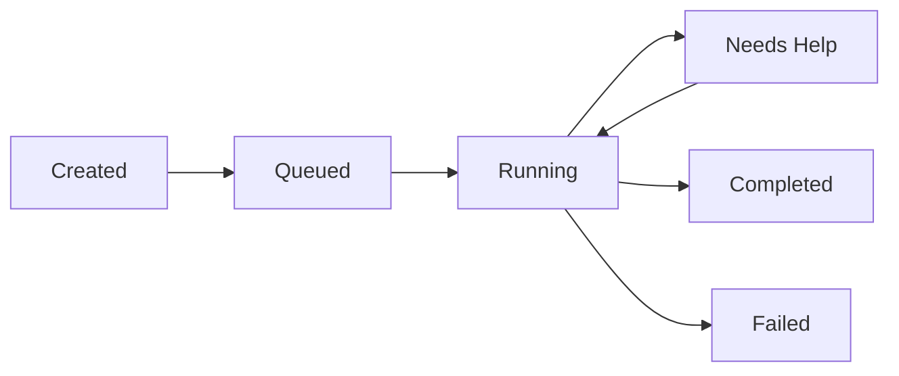

## Overview

The Bytebot Agent System transforms a simple desktop container into an intelligent, autonomous computer user. By combining Claude AI with structured task management, it can understand natural language requests and execute complex workflows just like a human would.


## How the AI Agent Works

### The Brain: Multi-Model AI Integration

At the heart of Bytebot is a flexible AI integration that supports multiple models. Choose the AI that best fits your needs:

**Anthropic Claude** (Default):
- Best for complex reasoning and visual understanding
- Excellent at following detailed instructions
- Superior performance on desktop automation tasks

**OpenAI GPT Models**:
- Fast and reliable for general automation
- Strong code understanding and generation
- Cost-effective for routine tasks

**Google Gemini**:
- Efficient for high-volume tasks
- Good balance of speed and capability
- Excellent multilingual support

The agent with any model:

1. **Understands Context**: Processes your natural language requests with full conversation history
2. **Plans Actions**: Breaks down complex tasks into executable computer actions
3. **Adapts in Real-time**: Adjusts its approach based on what it sees on screen
4. **Learns from Feedback**: Improves task execution through conversation

### Conversation Flow

<Steps>
  <Step title="You Describe a Task">
    "Research competitors for my SaaS product and create a comparison table"
  </Step>
  <Step title="AI Plans the Approach">
    The AI model understands the request and plans: open browser → search → visit sites → extract data → create document
  </Step>
  <Step title="Executes Actions">
    The agent controls the desktop: clicking, typing, taking screenshots, reading content
  </Step>
  <Step title="Provides Updates">
    Real-time status updates and asks for clarification when needed
  </Step>
  <Step title="Delivers Results">
    Completes the task and provides the output (files, screenshots, summaries)
  </Step>
</Steps>

## Task Management System

### Task Lifecycle

Tasks move through a structured lifecycle:



### Task Properties

Each task contains:

- **Description**: What needs to be done
- **Priority**: Urgent, High, Medium, or Low
- **Status**: Current state in the lifecycle
- **Type**: Immediate or Scheduled
- **History**: All messages and actions taken

### Smart Task Processing

The agent processes tasks intelligently:

1. **Priority Queue**: Urgent tasks run first
2. **Error Recovery**: Automatically retries failed actions
3. **Human in the Loop**: Asks for help when stuck
4. **Context Preservation**: Maintains conversation history across sessions

## Real-world Capabilities

### What the Agent Can Do

<CardGroup cols={2}>
  <Card title="Web Automation" icon="globe">
    - Browse websites
    - Fill out forms
    - Extract data
    - Download files
    - Monitor changes
  </Card>
  <Card title="Document Work" icon="file">
    - Create documents
    - Edit spreadsheets
    - Generate reports
    - Organize files
    - Convert formats
  </Card>
  <Card title="Email & Communication" icon="envelope">
    - Access webmail through browser
    - Read and extract information
    - Fill contact forms
    - Navigate communication portals
    - Handle verification flows
  </Card>
  <Card title="Data Processing" icon="database">
    - Extract from PDFs
    - Process CSV files
    - Create visualizations
    - Generate summaries
    - Transform data
  </Card>
</CardGroup>

## Technical Architecture

### Core Components

1. **NestJS Agent Service**
   - Integrates with multiple AI provider APIs (Anthropic, OpenAI, Google)
   - Handles WebSocket connections
   - Coordinates with desktop API

2. **Message System**
   - Structured conversation format
   - Supports text and images
   - Maintains full context
   - Enables rich interactions

3. **Database Schema**
   ```sql
   Tasks: id, description, status, priority, timestamps
   Messages: id, task_id, role, content, timestamps
   Summaries: id, task_id, content, parent_id
   ```

4. **Computer Action Bridge**
   - Translates AI decisions to desktop actions
   - Handles screenshots and feedback
   - Manages action timing
   - Provides error handling

### API Endpoints

Key endpoints for programmatic control:

```typescript
// Create a new task
POST /tasks
{
  "description": "Your task description",
  "priority": "HIGH",
  "type": "IMMEDIATE"
}

// Get task status
GET /tasks/:id

// Send a message
POST /tasks/:id/messages
{
  "content": "Additional instructions"
}

// Get task history
GET /tasks/:id/messages
```

## Chat UI Features

The web interface provides:

### Real-time Interaction
- Live chat with the AI agent
- Instant status updates
- Progress indicators
- Error notifications

### Visual Feedback
- Embedded desktop viewer
- Screenshot history
- Action replay
- Task timeline

### Task Management
- Create and prioritize tasks
- View active and completed tasks
- Export conversation logs
- Manage task queues

## Security & Privacy

### Data Isolation
- All processing happens in your infrastructure
- No data sent to external services (except your chosen AI provider API)
- Conversations stored locally
- Complete audit trail

### Access Control
- Configurable authentication
- API key management
- Network isolation options

## Extending the Agent

### Integration Points
- External API calls via the Agent API
- Custom AI prompts for specialized workflows
- MCP protocol support for tool integration


### Best Practices

1. **Clear Instructions**: Be specific about desired outcomes
2. **Break Down Complex Tasks**: Use multiple smaller tasks for better results
3. **Provide Context**: Include relevant files or URLs
4. **Monitor Progress**: Watch the desktop view for real-time feedback
5. **Review Results**: Verify outputs meet requirements

## Troubleshooting

<AccordionGroup>
  <Accordion title="Agent not responding">
    - Check your AI provider API key is valid
    - Verify agent service is running
    - Review logs for errors
    - Ensure sufficient API credits/quota with your provider
  </Accordion>
  
  <Accordion title="Slow task execution">
    - Monitor system resources
    - Check network latency
    - Reduce screenshot frequency
    - Optimize AI prompts for your chosen model
    - Consider switching to a faster model (e.g., Gemini Flash)
  </Accordion>
</AccordionGroup>

## Next Steps

<CardGroup cols={2}>
  <Card title="Quick Start" icon="rocket" href="/quickstart">
    Get your agent running
  </Card>
  <Card title="API Reference" icon="code" href="/api-reference/agent/tasks">
    Integrate with your apps
  </Card>
  <Card title="Use Cases" icon="lightbulb" href="#example-use-cases">
    See what's possible
  </Card>
  <Card title="Best Practices" icon="star" href="#best-practices">
    Optimize your workflows
  </Card>
</CardGroup>