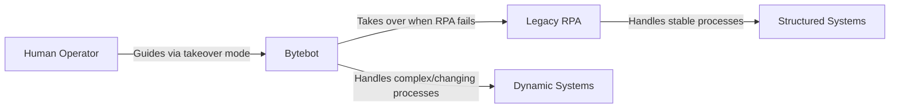

# The Next Generation of Enterprise Automation

Bytebot represents a fundamental shift in how businesses approach process automation. While traditional RPA tools like UiPath, Automation Anywhere, and Blue Prism require extensive scripting and brittle workflows, Bytebot leverages AI to understand and execute tasks like a human would.

## Traditional RPA Limitations

<CardGroup cols={2}>
  <Card title="Brittle Selectors" icon="xmark">
    Traditional RPA breaks when UI elements change even slightly
  </Card>
  <Card title="Complex Development" icon="code">
    Requires specialized developers and lengthy implementation cycles
  </Card>
  <Card title="High Maintenance" icon="wrench">
    Constant updates needed as applications evolve
  </Card>
  <Card title="Limited Adaptability" icon="robot">
    Can't handle unexpected scenarios or variations
  </Card>
</CardGroup>

## How Bytebot is Different

### Visual Intelligence vs Element Mapping

**Traditional RPA:**
```xml
<!-- Brittle selector that breaks with any UI change -->
<Click>
  <Selector>
    <webctrl id='submit-btn-2947' 
             class='btn-primary-new' 
             idx='3'/>
  </Selector>
</Click>
```

**Bytebot:**
```
"Click the blue Submit button at the bottom of the form"
```

Bytebot understands interfaces visually, just like a human. It doesn't rely on fragile technical selectors that break with every update.

### Natural Language vs Complex Scripting

**Traditional RPA Workflow:**
- Design in Studio
- Map every element
- Script error handling
- Test extensively
- Deploy with fingers crossed
- Fix when it breaks (often)

**Bytebot Workflow:**
- Describe what you need
- Bytebot figures it out
- Handles errors intelligently
- Adapts to changes automatically

## Real-World Enterprise Examples

### Financial Services Automation

<Tabs>
  <Tab title="Traditional RPA">
    ```csharp
    // 500+ lines of code to handle one banking portal
    var loginPage = new LoginPageObject();
    loginPage.WaitForElement("username", 30);
    loginPage.EnterText("username", credentials.User);
    loginPage.EnterText("password", credentials.Pass);
    
    // Handle 2FA with complex conditional logic
    if (loginPage.Has2FAPrompt()) {
      var method = loginPage.Get2FAMethod();
      switch(method) {
        case "SMS":
          // 50 more lines of code
        case "Email":
          // 50 more lines of code
        case "Authenticator":
          // 50 more lines of code
      }
    }
    
    // Download statements with exact selectors
    navigation.ClickElement("xpath://div[@id='acct-menu']");
    navigation.ClickElement("xpath://a[contains(@href,'statements')]");
    // ... continues for hundreds more lines
    ```
  </Tab>
  <Tab title="Bytebot">
    ```
    Task: "Log into Chase banking portal, navigate to statements, 
    download all statements from last month for account ending in 4521, 
    and save them to Finance/BankStatements/Chase/"
    
    That's it. Bytebot handles everything - including 2FA - automatically.
    ```
  </Tab>
</Tabs>

### Multi-System Integration

A FinTech company needed to automate operators who:
1. Log into multiple banking portals with 2FA
2. Download transaction files
3. Run proprietary scripts on those files
4. Upload results to internal systems

**Traditional RPA Challenge:**
- 6 months to implement
- Breaks monthly with UI changes
- Requires dedicated maintenance team
- Can't handle new banks without development
- Complex 2FA handling logic for each bank

**Bytebot Solution:**
- Deployed in 1 week
- Adapts to UI changes automatically
- 2FA handled automatically via password manager
- New banks added with simple instructions
- Zero manual intervention required

## Performance Comparison

| Metric | Traditional RPA | Bytebot |
|--------|----------------|---------|
| **Implementation Time** | 3-6 months | 1-2 weeks |
| **Developer Requirement** | RPA specialists | Any technical user |
| **Maintenance Effort** | 40% of dev time | Near zero |
| **Handling UI Changes** | Breaks immediately | Adapts automatically |
| **Error Recovery** | Pre-scripted only | Intelligent adaptation |
| **New Process Addition** | Weeks of development | Minutes to describe |
| **Cost** | $100k+ annually | Self-hosted on your infrastructure |

## Common RPA Migration Patterns

### 1. Invoice Processing

**Before (UiPath):**
- 2000+ lines of workflow XML
- Breaks when vendor portal updates
- Requires exact folder structures
- Failed on unexpected popups

**After (Bytebot):**
- One paragraph description
- Handles portal changes
- Asks for help when needed
- Processes variations intelligently

### 2. Compliance Reporting

**Before (Automation Anywhere):**
- Complex bot orchestration
- Separate bots per system
- Rigid scheduling
- No flexibility

**After (Bytebot):**
- Single unified workflow
- Natural language instructions
- Dynamic adaptation
- Human collaboration when needed

### 3. Data Migration

**Before (Blue Prism):**
- Massive process definitions
- Exact field mapping required
- Breaks on data variations
- Limited error handling

**After (Bytebot):**
- Describe the mapping rules
- Handles variations intelligently
- Asks for clarification
- Visual validation included

## Integration with Existing RPA

Bytebot can work alongside existing RPA investments:



## Enterprise Architecture

### Deployment Options

<CardGroup cols={2}>
  <Card title="On-Premise" icon="server">
    Deploy in your data center for maximum security and compliance
  </Card>
  <Card title="Private Cloud" icon="cloud">
    Use your AWS/Azure/GCP infrastructure with full control
  </Card>
  <Card title="Hybrid" icon="arrows-split-up-and-left">
    Process sensitive data locally, leverage cloud for scaling
  </Card>
  <Card title="Air-Gapped" icon="shield">
    Completely isolated deployment for classified environments
  </Card>
</CardGroup>

### Security & Compliance

- **Data Sovereignty**: All processing on your infrastructure
- **Audit Trails**: Complete logs of every action
- **Access Control**: Integrate with your IAM/SSO
- **Compliance**: SOC2, HIPAA, PCI-DSS compatible deployments

## Getting Started with Migration

<Steps>
  <Step title="Identify Processes">
    List your current RPA workflows, especially:
    - Those that break frequently
    - Require regular maintenance
    - Handle multiple systems
    - Need human decision points
  </Step>
  
  <Step title="Start Small">
    Pick one problematic workflow:
    - Document the business process
    - Deploy Bytebot
    - Describe the task naturally
    - Compare results
  </Step>
  
  <Step title="Expand Gradually">
    As confidence grows:
    - Migrate more complex processes
    - Retire brittle RPA bots
    - Reduce maintenance overhead
    - Scale across departments
  </Step>
</Steps>

## Next Steps

<CardGroup cols={2}>
  <Card title="Quick Start" icon="rocket" href="/quickstart">
    Deploy Bytebot in your environment
  </Card>
  <Card title="GitHub" icon="github" href="https://github.com/bytebot-ai/bytebot">
    View source code and contribute
  </Card>
  <Card title="Community" icon="users" href="https://discord.gg/zcb5wA2t4u">
    Join our Discord for support
  </Card>
  <Card title="Enterprise Support" icon="users" href="https://discord.gg/zcb5wA2t4u">
    Get help with enterprise deployments
  </Card>
</CardGroup>

<Note>
  **Ready to move beyond traditional RPA?** Bytebot brings human-like intelligence to process automation, eliminating the brittleness and complexity of traditional tools while delivering enterprise-grade reliability and security.
</Note>